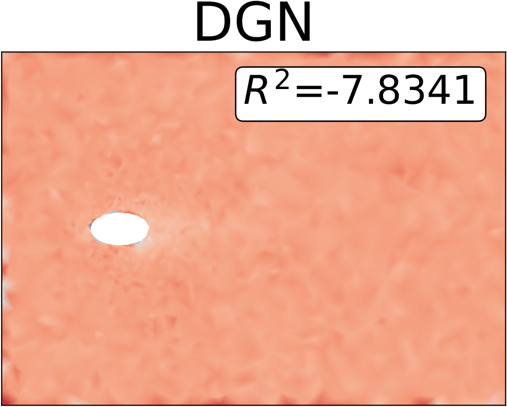
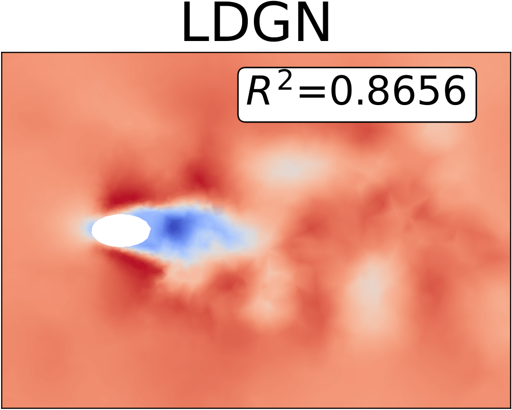
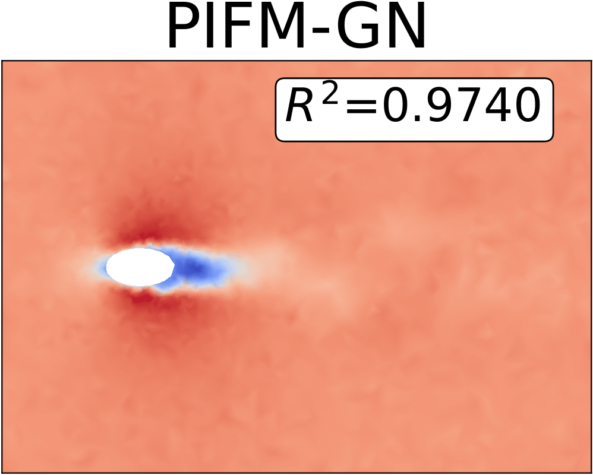

# pifm-gn

This repository contains code and examples for our NeurIPS submission "Physically-Informed Flow Matching with Graph Neural Networks for Complex Fluid Dynamics".

  
  
  
  

## Overview

Our model implementations can be found in `/nn/flow_matching/models` directory, specifically in:
- `pifm_gn.py` (Physics-Informed Flow Matching Graph Network)
- `latent_pifm_gn.py` (Latent Physics-Informed Flow Matching Graph Network)

This project adapts from the dgn4cfd package. To use our code:

1. First install dgn4cfd package from their official git repo
2. Set up a Python virtual environment following our dependencies in `requirements.txt`
3. Training examples and parameter configurations are provided in the `/examples` directory
4. If you need help for visualizations and evaluation, we recommendation you to refer to the dgn4cfd package official [evaluation script](https://github.com/tum-pbs/dgn4cfd/blob/main/examples/EllipseFlow/inference.ipynb).
5. We will release the full codes after the paper released/published.

Our physically-informed approach enhances flow matching performance by incorporating physical principles directly into the model architecture, resulting in more accurate fluid dynamics simulations with fewer sampling steps.